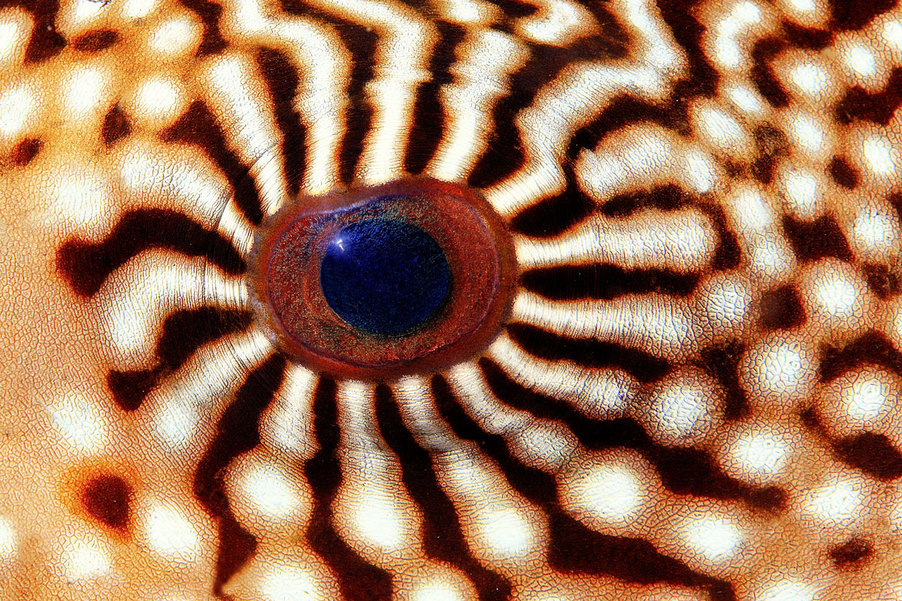
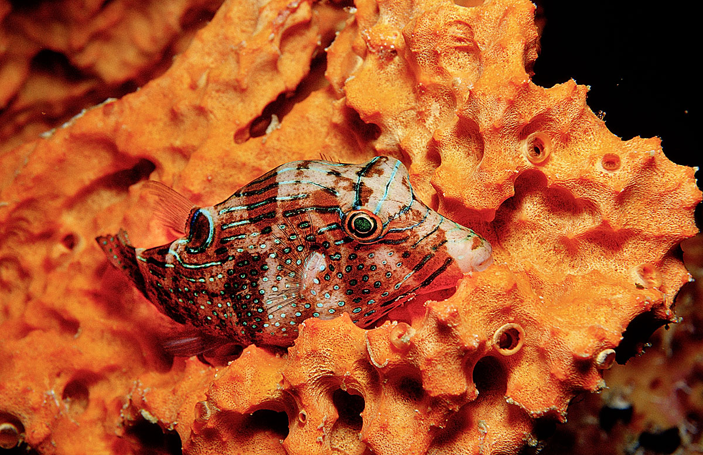
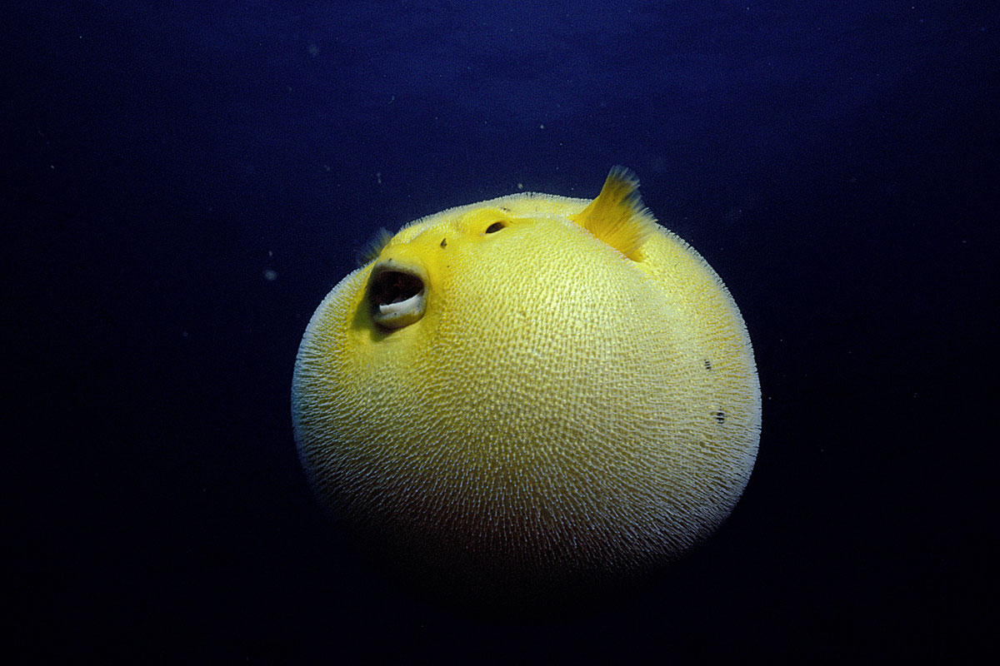

# ZOOLOGY: PAINTERS AND TINKERS

Do not judge about puffins by their appearance. These unattractive in appearance fish can create architectural masterpieces, and after their death they themselves become outstanding works of culinary art - the legendary poisonous fugue dish.

In the mid-1990s, divers, diving into the sea near the Japanese Ryukyu Archipelago, noticed strange patterns on the sandy bottom. Concentric circles, crossed by many radial rays, resembled the imprint of an alien ship and remained a mystery until the 2010s, when it turned out that they were created by fish - puffins. 

## Deep Beauty

If to judge only by their appearance, it is as difficult to suspect these fish in a high aesthetic sense as to recognize the master of painting for the rough, "peasant" features of Pablo Picasso. Even in small species, the body looks short and heavy, with a disproportionately small tail. It is hardly used for movement, joining in occasional short and not too fast jerks. Usually, puffins maneuver at the bottom with strong pectoral fins, which allow them to move with equal ease in any direction, including backwards, which is rare for fish.

However, even with such elegant maneuvers, puffins do not look elegant at all. Powerful breasts move into a heavy head with big, convex eyes. The teeth, fused into plates - two at the top and two at the bottom - as if they do not fit in the mouth, which makes it seem that the face of the fish froze ugly grimaces (not without reason in Russian literature, these fish are also called rock teeth). 

Slowly, she carries her "smile", searching the bottom in search of food. There is no hurry for the puffer-belly: its prey - bottom crustaceans, molluscs, coral polyps, echinoderms - is harder to chew than to catch. And in case of attack, the fish have a set of very unpleasant surprises.

## Bright image of the ball

In case of danger, the puffins quickly gather water in baggy stomach outgrowths. It should be admitted that in this transformation there is something from modern painting, only on the portraits of Picasso's brush figures and faces acquire cubic forms, and his underwater "colleagues" themselves become spherical. Blind growths, locked with circular muscles, increase their volume by 50-100 times, inflating the fish several times. 

On the bare, scaleless skin, the sharpest spikes rise - not only in the belly area, as one could conclude from the name, but also from the sides and back. The spiky ball is made impregnable from all sides. Repeating this is not recommended: for such a spectacular protection, pelvic pelvis had to sacrifice a lot, including the ribs and bones of the pelvis, which, if inflated, could break. In addition, the resilient skin of these fish is particularly rich in collagen, which gives them strength. 

It is believed that even the puffer stomach has lost its main function, transferring all food digestion tasks to the intestines located closer to the tail. But the bright image of the barbed ball, which appeared as if from nowhere, works almost smoothly, discouraging most predators. And if someone turns out to be insensitive to such a picture and decides to grab a fish, it can be the last meal in his life.
